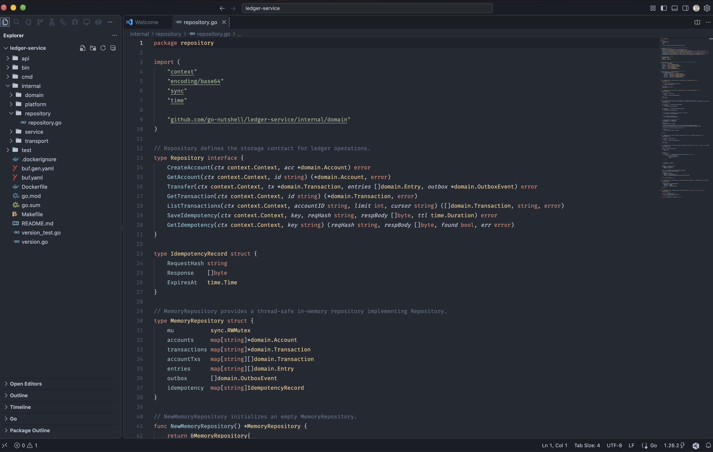

# Dark Knight — VS Code Theme

  

A refined dark theme suite for VS Code, originally created for Golang projects and now expanded with the **Nordic** palette (Nord, but Aurora > Frost).

---

## Themes

Dark Knight includes three theme variants:

1. **Dark Knight Nordic** — A warmer and darker Nord-inspired theme ported from [nordic.nvim](https://github.com/AlexvZyl/nordic.nvim).
2. **Dark Knight Nordic Italic** — Nordic with elegant italic styling for keywords, storage modifiers, functions, methods, and language variables.
3. **Dark Knight Midnight** — The original classic Dark Knight theme with its signature deep dark-blue palette.

---

### Dark Knight Nordic

### Dark Knight Midnight

---

## Features

- **Rich Workbench Palette**: Editor, sidebar, status bar, activity bar, terminal (all 16 ANSI slots), git decorations, diff editor, breadcrumbs, notifications, and menus.
- **Precision Syntax Highlighting**: Comprehensive TextMate grammar rules for:
  - **Go**: Package, import, functions, methods, structs, interfaces, built-ins, and control flow.
  - **Java**: Annotations, modifiers, generics, interfaces, enums, Javadoc, and lambda expressions.
  - **Python**: Decorators, magic/dunder methods, type hints, built-ins, and docstrings.
  - **TypeScript / JavaScript**: Interfaces, type aliases, generic parameters, decorators, and JSX tags.
  - **Rust**: Lifetimes, macros, traits, visibility modifiers, and module paths.
  - **C/C++**, **CSS/SCSS**, **HTML**, **JSON**, **Markdown**, and **Diff**.
- **Semantic Highlighting Support**: Full alignment with LSP semantic tokens (`gopls`, `rust-analyzer`, `pyright`, `redhat.java`, TypeScript).

---

## Installation

1. Open **Extensions** in VS Code (`Ctrl+Shift+X` or `Cmd+Shift+X`).
2. Search for `Nordic` (publisher: **DarkKnight**).
3. Click **Install**.
4. Press `Ctrl+K Ctrl+T` (or `Cmd+K Cmd+T`) and select:
   - **Dark Knight Nordic**
   - **Dark Knight Nordic Italic**
   - **Dark Knight Midnight**

---

## Palette Reference

For the exact color derivations and hex-by-hex palette documentation of the Nordic theme, see [PALETTE.md](./PALETTE.md).

---

## License

[MIT](https://github.com/netologist/dark-knight-vscode/blob/master/package.json)
